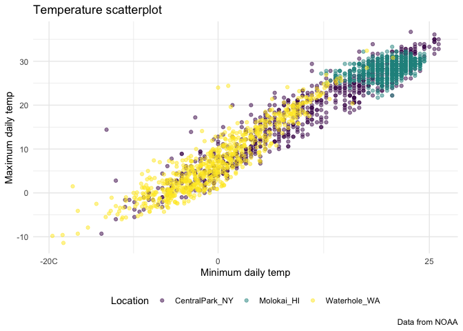

Viz II
================

Import the weather data

``` r
data("weather_df")
```

Let’s make our basic scatterplot

``` r
weather_df |> 
  ggplot(aes(x = tmin, y = tmax)) + 
  geom_point(aes(color = name), alpha = 0.5) + 
  labs(
    x = "Minimum daily temp",
    y = "Maximum daily temp",
    title = "Temperature scatterplot", 
    caption = "Data from NOAA",
    color = "Location"
  )
```

    ## Warning: Removed 17 rows containing missing values or values outside the scale range
    ## (`geom_point()`).

<!-- -->

## Scales

``` r
weather_df |> 
  ggplot(aes(x = tmin, y = tmax)) + 
  geom_point(aes(color = name), alpha = 0.5) + 
  labs(
    x = "Minimum daily temp",
    y = "Maximum daily temp",
    title = "Temperature scatterplot", 
    caption = "Data from NOAA",
    color = "Location"
  ) + 
  scale_x_continuous(
    breaks = c(-20, 0, 25),
    labels = c("-20C", "0", "25")
  ) + 
  viridis::scale_color_viridis(
    discrete = TRUE
  )
```

    ## Warning: Removed 17 rows containing missing values or values outside the scale range
    ## (`geom_point()`).

<!-- -->

## Themes

Make my base plot.

``` r
ggp_temperature = 
  weather_df |> 
  ggplot(aes(x = tmin, y = tmax)) + 
  geom_point(aes(color = name), alpha = 0.5) + 
  labs(
    x = "Minimum daily temp",
    y = "Maximum daily temp",
    title = "Temperature scatterplot", 
    caption = "Data from NOAA",
    color = "Location"
  ) + 
  scale_x_continuous(
    breaks = c(-20, 0, 25),
    labels = c("-20C", "0", "25")
  ) + 
  viridis::scale_color_viridis(
    discrete = TRUE
  )

ggsave("weather_scatterplot.png", ggp_temperature)
```

    ## Saving 7 x 5 in image

    ## Warning: Removed 17 rows containing missing values or values outside the scale range
    ## (`geom_point()`).

Update my base plot

``` r
ggp_temperature + 
  theme_minimal() +
  theme(legend.position = "bottom")
```

    ## Warning: Removed 17 rows containing missing values or values outside the scale range
    ## (`geom_point()`).

<!-- -->

## Adding data in geoms

``` r
central_park_df =
  weather_df |> 
  filter(name == "CentralPark_NY")

molokai_df = 
  weather_df |> 
  filter(name == "Molokai_HI")

ggplot(data = molokai_df, aes(x = date, y = tmax, color = name)) + 
  geom_point() + 
  geom_line(data = central_park_df)
```

    ## Warning: Removed 1 row containing missing values or values outside the scale range
    ## (`geom_point()`).

<!-- -->
